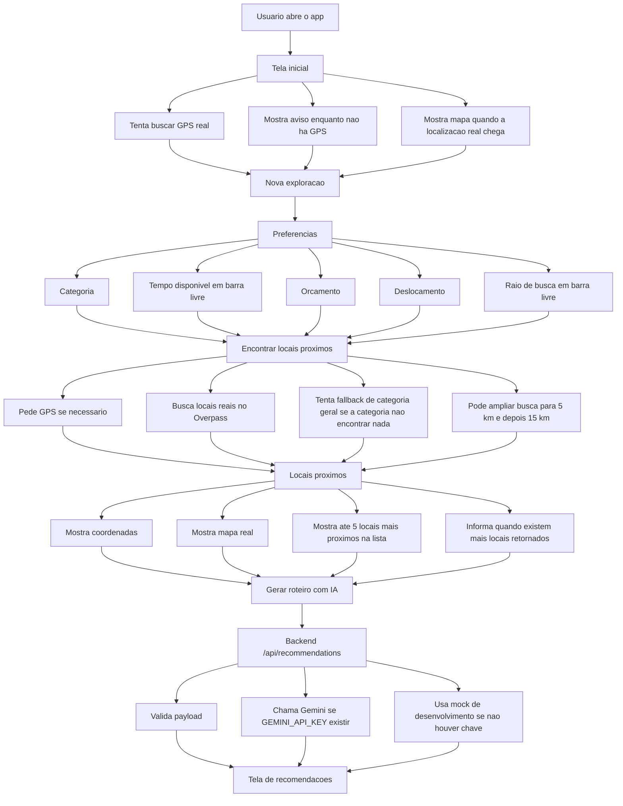
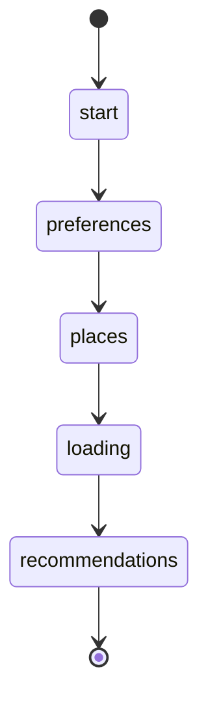
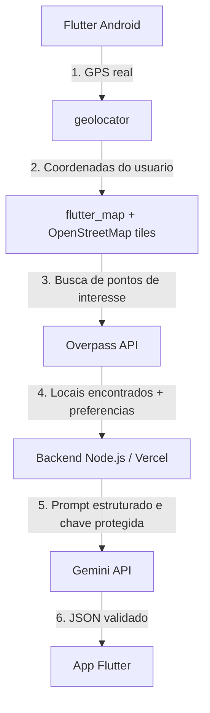

# TouristAI

TouristAI e um app mobile academico em Flutter para Android. O app usa GPS real,
mapa com OpenStreetMap, busca de locais proximos via Overpass e uma API propria
com Gemini para gerar um roteiro personalizado.

O objetivo do projeto e demonstrar, em smartphone Android fisico, um app que:

- usa localizacao real do usuario;
- mostra mapa na interface;
- busca locais proximos com beneficio pratico;
- coleta preferencias do usuario;
- chama um backend via HTTP;
- usa IA no backend sem expor chave no app;
- exibe recomendacoes claras para uma visita ou passeio.

## Mapa geral das pastas

```text
Proj-turistai/
├── AGENTS.md                         # Contexto e regras para agentes no repo
├── README.md                         # Documento principal do projeto
├── backend/                          # API Node.js local e Vercel Function
│   ├── api/
│   │   └── recommendations.js         # Entrada da Vercel Function
│   ├── src/
│   │   ├── gemini_recommendations.js  # Integracao com Gemini API
│   │   ├── http_server.js             # Servidor HTTP local
│   │   └── recommendations.js         # Regra do endpoint de recomendacoes
│   ├── test/                          # Testes automatizados do backend
│   ├── dev-server.js                  # Servidor local em 0.0.0.0:3000
│   └── package.json
├── docs/                              # Documentacao academica e tecnica
│   ├── API_CONTRATO.md
│   ├── ARQUITETURA.md
│   ├── PLANO_IMPLEMENTACAO.md
│   ├── ROTEIRO_APRESENTACAO.md
│   ├── TESTES_MANUAIS.md
│   └── TRABALHO_ACADEMICO.md
└── mobile/                            # App Flutter
    ├── android/                       # Projeto Android gerado pelo Flutter
    ├── lib/
    │   ├── main.dart                  # Tema e bootstrap do app
    │   ├── screens/
    │   │   └── home_screen.dart       # Orquestrador do fluxo principal
    │   ├── services/
    │   │   ├── location_service.dart
    │   │   ├── places_service.dart
    │   │   └── recommendation_service.dart
    │   └── widgets/
    │       ├── current_location_map.dart
    │       ├── location_status_card.dart
    │       ├── places_summary_card.dart
    │       ├── preference_dropdown.dart
    │       ├── preference_slider.dart
    │       └── recommendation_card.dart
    ├── test/                          # Testes de services e widgets
    └── pubspec.yaml
```

## Fluxo do app



## Interface atual

A tela principal e controlada por `mobile/lib/screens/home_screen.dart` com um
fluxo linear de estados:



## Arquitetura



### Mobile

O app Flutter e responsavel por:

- iniciar o app e tema em `main.dart`;
- controlar fluxo de tela em `home_screen.dart`;
- acessar GPS com `LocationService`;
- buscar locais no Overpass com `PlacesService`;
- chamar o backend com `RecommendationService`;
- renderizar mapa, cards, preferencias, estados de erro e resultado da IA.

Principais dependencias:

| Dependencia | Uso |
| --- | --- |
| `geolocator` | GPS e permissoes de localizacao |
| `flutter_map` | Mapa com tiles do OpenStreetMap |
| `latlong2` | Coordenadas e calculo de distancia |
| `http` | Requisicoes HTTP |
| `google_fonts` | Tipografia visual do app |
| `flutter_lints` | Analise estatica no desenvolvimento |

### Backend

O backend e responsavel por:

- expor `POST /api/recommendations`;
- validar localizacao, preferencias e locais;
- proteger a chave `GEMINI_API_KEY`;
- chamar a Gemini API quando a chave existir;
- devolver mock estruturado quando estiver rodando sem chave;
- retornar erros HTTP previsiveis.

O backend nao usa banco de dados, autenticacao ou sessao de usuario.

Principais arquivos:

| Arquivo | Responsabilidade |
| --- | --- |
| `backend/api/recommendations.js` | Handler usado pela Vercel |
| `backend/src/recommendations.js` | Validacao, fallback e orquestracao da IA |
| `backend/src/gemini_recommendations.js` | Chamada REST para Gemini e validacao do JSON |
| `backend/src/http_server.js` | Servidor local usado em desenvolvimento |
| `backend/dev-server.js` | Sobe o backend em `0.0.0.0:3000` por padrao |

## Preferencias do usuario

O app coleta:

| Campo visual | Enviado para a API | Observacao |
| --- | --- | --- |
| Categoria | `category` | `comida`, `cultura`, `natureza`, `estudo`, `turismo` |
| Tempo disponivel | `availableMinutes` | Slider de 15 a 240 minutos |
| Orcamento | `budget` | `gratis`, `baixo`, `medio` |
| Deslocamento | `transportMode` | `a_pe`, `carro` |
| Raio de busca | `radiusMeters` | Slider de 500 a 30000 metros |

## Busca de locais

`PlacesService` chama:

```text
https://overpass-api.de/api/interpreter
```

Categorias suportadas:

- comida;
- cultura;
- natureza;
- estudo;
- turismo;
- geral.

Regras importantes:

- locais sem nome sao ignorados;
- distancia ate o usuario e calculada no app;
- a lista e ordenada por distancia;
- o service retorna no maximo 12 locais;
- a tela mostra ate 5 locais;
- a IA recebe ate 5 locais.


Erros principais:

| Status | Codigo | Quando acontece |
| --- | --- | --- |
| `400` | `invalid_request` | Payload invalido ou sem locais |
| `405` | `method_not_allowed` | Metodo diferente de `POST` |
| `502` | `ai_provider_error` | Falha ao obter resposta valida da Gemini |

## Integracao com Gemini

O backend usa a Gemini apenas no servidor. A chave nunca deve ir para o app
Flutter.

Variaveis:

| Variavel | Obrigatoria | Uso |
| --- | --- | --- |
| `GEMINI_API_KEY` | Sim em producao | Chave da Gemini API |
| `GEMINI_MODEL` | Nao | Modelo usado no backend |

Modelo padrao no codigo:

```text
gemini-3.5-flash
```

Detalhe importante da integracao:

```text
generationConfig.responseFormat.text.mimeType = APPLICATION_JSON
```

Nao trocar para `application/json`, porque esse formato ja causou erro HTTP 400
na Gemini neste projeto.

## Requisitos locais

Mobile:

- Flutter com SDK Dart compativel com `^3.12.0`;
- Android SDK configurado;
- smartphone Android ou emulador;
- internet ativa para mapa, Overpass e backend.

Backend:

- Node.js `>=22`;
- npm;
- acesso a internet para chamar Gemini, quando a chave estiver configurada.

## Como rodar o backend local

Sem Gemini real, o backend usa mock de desenvolvimento:

```bash
cd backend
npm install
npm run dev
```

Com Gemini real usando `backend/.env` local:

```bash
cd backend
node --env-file=.env dev-server.js
```

O servidor local sobe por padrao em:

```text
http://0.0.0.0:3000
```

Para testar no celular usando backend local, use o IP da maquina na rede:

```text
http://SEU_IP_LOCAL:3000
```

## Como rodar o app

Instale as dependencias Flutter:

```bash
cd mobile
flutter pub get
```

Rodar usando backend publicado na Vercel:

```bash
cd mobile
flutter run --dart-define=TOURISTAI_API_BASE_URL=https://touristai-backend.vercel.app
```

Rodar usando backend local:

```bash
cd mobile
flutter run --dart-define=TOURISTAI_API_BASE_URL=http://SEU_IP_LOCAL:3000
```

Exemplo com IP local:

```bash
cd mobile
flutter run --dart-define=TOURISTAI_API_BASE_URL=http://192.168.0.101:3000
```

Se `TOURISTAI_API_BASE_URL` nao for informado, o app usa:

```text
http://localhost:3000
```

Isso funciona no emulador dependendo da configuracao, mas normalmente nao
funciona no celular fisico. Para celular fisico, use IP local ou a URL da
Vercel.

## Gerar APK

APK release apontando para a Vercel:

```bash
cd mobile
flutter build apk --release --dart-define=TOURISTAI_API_BASE_URL=https://touristai-backend.vercel.app
```

Instalar APK release em celular conectado:

```bash
cd mobile
flutter install --release
```

## Deploy do backend

Backend publico atual:

```text
https://touristai-backend.vercel.app
```

Deploy de producao:

```bash
cd backend
npx vercel@latest --prod
```

Na Vercel, configurar:

```text
GEMINI_API_KEY
```

Opcional:

```text
GEMINI_MODEL
```

Se aparecer `Authentication Required`, provavelmente foi usada uma URL de deploy
protegida. Use o alias publico:

```text
https://touristai-backend.vercel.app
```

## Testes

Backend:

```bash
cd backend
npm test
```

Mobile:

```bash
cd mobile
flutter test
flutter analyze
```

Aviso esperado:

- testes que renderizam `flutter_map` podem mostrar aviso sobre politica de uso
  dos tiles publicos do OpenStreetMap;
- isso e aviso da biblioteca, nao falha de teste.

Ultima verificacao conhecida neste estado:

- `cd backend && npm test` passando;
- `cd mobile && flutter test` passando;
- `cd mobile && flutter analyze` sem issues.


## Documentos complementares

- [Contrato da API](docs/API_CONTRATO.md)
- [Arquitetura](docs/ARQUITETURA.md)
- [Plano de implementacao](docs/PLANO_IMPLEMENTACAO.md)
- [Roteiro de apresentacao](docs/ROTEIRO_APRESENTACAO.md)
- [Testes manuais](docs/TESTES_MANUAIS.md)
- [Trabalho academico](docs/TRABALHO_ACADEMICO.md)
